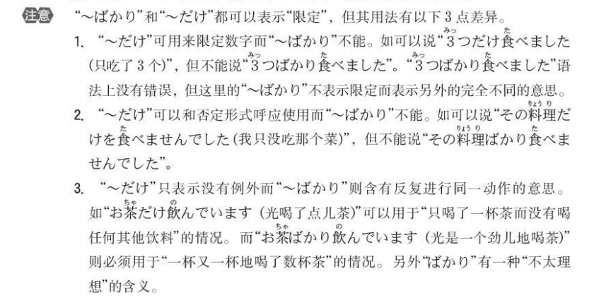
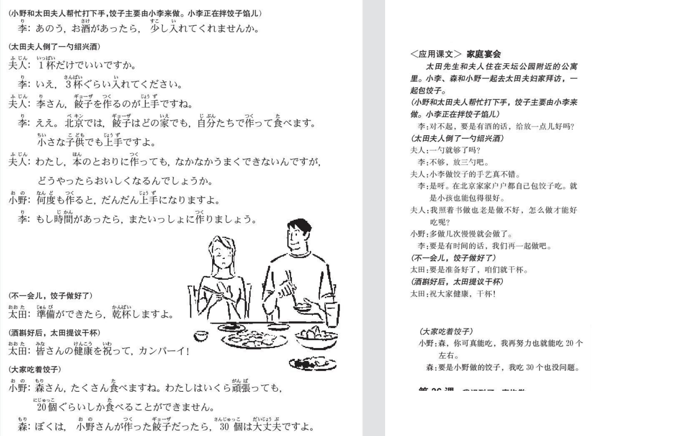
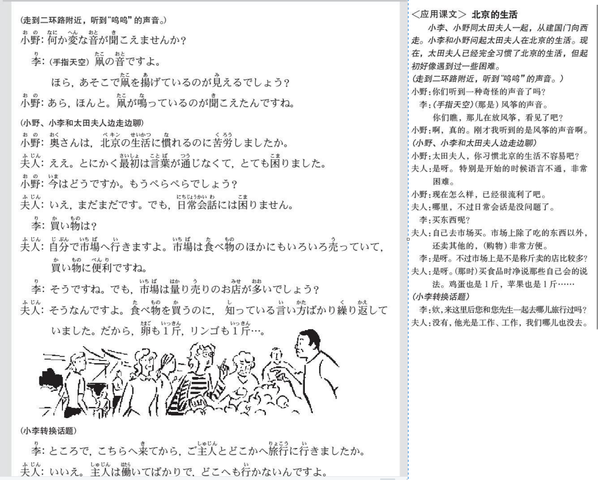

## 聴力

​																					「少子化」という言葉

最近の新聞には＿＿＿＿＿＿＿＿＿＿。

たとえば、「新学期が始まりましたが、新たに小学校に入る子供たちの数は＿＿＿＿＿、＿＿＿＿＿＿」のように使われます。

このことからも分かるように、少子化とは＿＿＿＿＿＿が年々少なくなっている現象のことです。

この少子化という言葉はまるで昔からあったように使われていますが、実は＿＿＿＿＿＿はなかったのです。

少子の少は＿＿＿＿＿＿＿＿＿、少子とは元は一番若い子供、＿＿＿＿＿＿＿＿＿。

朝日新聞の調査によれば、少子化という言葉は1992年の国民生活白書に登場してから、＿＿＿＿＿＿＿＿＿＿。

この頃から＿＿＿＿＿＿＿＿＿＿＿＿になってきたからでしょう。

最近は＿＿＿＿＿＿＿＿＿＿＿＿＿＿が日本語と同じ意味で使われている例がいくつも見つかっているそうです。

以前「哲学」や「社会」という言葉が日本から中国に逆輸出されたのと同じように、＿＿＿＿＿＿＿＿＿＿＿＿＿＿。

## 原稿

最近の新聞には少子化という言葉が目立つようになってきました。

 最近的报纸上少子化这个词变得引人注目了

たとえば、「新学期が始まりましたが、新たに小学校に入る子供たちの数は少子化の影響で毎年減るいっぽうです」のように使われます。

 例如，“新学期开始了，但是由于少子化的影响，新入学小学的孩子们的数量每年都在减少”在这种类型的地方被使用

このことからも分かるように、少子化とは女性が産む子供の数が年々少なくなっている現象のことです。

从这件事也可以看出，所谓少子化，就是女姓产子数量逐年减少的现象。

この少子化という言葉はまるで昔からあったように使われていますが、実は少子化という言葉には子供が少ないという意味はなかったのです。

少子化这个词汇，好像从以前就有使用到，但实际上少子化这个词汇没有孩子减少这种意思

少子の少は若いとか、幼いという意味で、少子とは元は一番若い子供、つまり、末子のことでした。

少子的“少”是年轻、年幼的意思，少子原本是指最年轻的孩子，也就是最小的孩子。

朝日新聞の調査によれば、少子化という言葉は1992年の国民生活白書に登場してから、急に使われるようになったということです。

根据朝日新闻的调查，少子化这个词在1992年的国民生活白皮书中出现以来，就迅速被使用起来了

この頃から子供の減少が大きな社会問題になってきたからでしょう。

因为从这个时候开始孩子的减少成为了很大的社会问题吧。

最近は中国でもこの「少子化」という言葉が日本語と同じ意味で使われている例がいくつも見つかっているそうです。

最近在中国也发现了好几个少子化这个词和日语意思相同的例子。

以前「哲学」や「社会」という言葉が日本から中国に逆輸出されたのと同じように、「少子化」もこれから中国で広く使われるようになるかもしれません

或许这跟以前“哲学”和“社会”这些词汇，从日本再输出回中国一样，“少子化”从现在开始会在中国被广泛使用起来。

## 35课

### 语法

**（1）～たら**

**接続：**动词、形容词、形容动词的过去形 + たら　

​			名词 ＋だったら

**意味：**表示假定，有了前项的条件、因素、契机等发了后项，强调先后顺序。可以在假设前项完成基础上，再假设后项内容(后项可以为确定会实际生或不确定实际是否会发生）。对于后项无任何限制，可以接命令、请求、劝诱等内容。

**注意：**二类形容词和名词的过去否定形式“ではなかった”后续“たら”，要去掉其中的“は”,		变成“でなかった”

**区分：**「と」「ば」「たら」「なら」

- 「と」前面的动作发生后，100%会发生后面的动作。常用来表示当立，自然现象。

  北海道では、冬になると（なったら）雪が降ります

- 「ば」主要用于惯用语，谚语，惯用句（すればするほど／なければならない），用法比较固定。有时也可用来表示必然结果，某些句子可以与「と」想通

  先生に聞けばわかる

- 「なら」假设前面的动作尚未进行，而给予后面的建议或意见

  タバコを吸うなら、中に入らないでください

- 「たら」表示如果前面的动作发生，就会产生后方的结果。

  与「なら」的区别是，比较口语，使用的频率较高。如果不知道使用「たら」，「なら」时，建议使用「たら」

  家に帰ったら、まず宿題をしなさい

**建议：如果你不太清楚用哪个好的时候，就使用たら**

> 这本书如果看完了，请还给我（この本を読み終わったら、返してね）
>
> 如果吃了这个药，就会退烧（この薬を飲んだら、熱が下がります）
>
> 如果明天天气好的话，一起去玩吗？（明日いい天気だったら、遊びに行きませんか）
>
> 如果是平板的话，就可以下载那个游戏（タブレットだったら、そのゲームをダウンロードできます）
>
> 如果中意的手机便宜的话，就想要买它。（気に入る携帯が安かったら、買いたいです。）
>
> 如果工地的声音太吵的话，请把窗关上（工事の音がうるさかったら、窓を閉めてください）
>
> 如果明天不下雨，就去郊游（明日雨でなかったら／雨が降らなかったら、ハイキングに行きます）
>
> 如果聚会不开心的话，也可以先回家（パーティーが楽しくなかったら、先に家に帰ってもいいです。）
>

**（2）～ても**

**接続：**V（て形） + も
			イA + くても
			なA + でも
			N + でも

**意味：**即使……

> 即使被父母反对，我们也打算结婚（親に反対されても、僕たちは結婚するつもりです。）
>
> 即使中彩票，我也不打算买高价物品（宝くじが当たっても、高価な物を買うつもりはありません。）
>
> 那家餐馆的菜评价不好，即使便宜也绝对不去（あのレストランの料理は評判が悪いし、安くても絶対に行かない）
>
> 即使成绩不好，我也喜欢学习日语，所以毕业后也想继续学习（成績が悪くても、日本語の勉強は好きなので、卒業してからも続けたい。）
>
> 因为没有钱，所以星期天也要工作。（お金がないので、日曜日でも働きます。）
>
> 即使是星期六，我也是7点起床（私は土曜日でも、７時に起きます。）

**（3）～でも**

**接続：**N/疑问词+でも

**意味：**

- 表类推：举出极端的例子来形容程度之极，称为“類推",多译为“连...也...”
- 表列举：列举某个种类，多用于询问对方，邀约的内容则是任意举个例子，代表还有选择的空间，口气上比较亲和，委婉。多译为“之类的/什么的
- 表全面：疑问词(如どこ、だれ、なん、いつ...)+でも則表示全面性的无线范围，后项只能接「肯定句」（不能接否定形或字眼）、多译为「无论~都~」

> 就连祖母也使用智能手机（おばちゃんでもスマホを使っています）
>
> 这个问题很难，就连老师也不明白（この問題が難しい、先生でも分からないです）
>
> 要不要喝茶什么的？（ お茶でも飲みませんか。）
> 要不要去看電影什么的？（ 映画でも見に行こうか。）
>
> 桃太郎是誰都知道的故事。（桃太郎は誰でも知っている物語です。）
> 如果有什麼不懂的地方，歡迎隨時問我。（わからないことがあったら，いつでも聞いてください。 ）

**（4）「～だけ」と「～しか」**

**接続：**N+だけ/しか

**意味：**只...

**注意：**

- 「しか」后用否定，「だけ」后可用肯定也可用否定。
  （まだ）半分だけある。（だから大丈夫）/还剩一半（所以没关系）。
  （もう）半分しかない。（だからダメ）/只剩下一半了（所以不行）。

- 「しか」比「だけ」更加具有排他性，特别用于强调情况的单一和特殊的限定，语气上更为强烈。

- 某些情况下，两者同时使用，更加突出其单一性。
  如：あの人は自分のことだけしか考えないよ。/那人只关心自己的事情（其他什么都不管）。

- 「しか」有一种遗憾的意味。
  如：５本しか借りません。/表示我原本想借５本以上的，但仅仅只能借５本，有一种遗憾的意味。而「だけ」无此意味。

> 只是有些累了而已。（少し疲れただけです。）
>
> 只有他去过日本（彼だけ日本へ行ったことがあるんです）
>
> 只有田中一个人能做这个工作（この仕事ができるのは田中だけだ。/
> この仕事ができるのは田中しかいない）
>
> 因为那里没有地铁，只能坐出租车去 （あそこは地下鉄がないから、タクシーで行くしかない ）

### 表达及词语

（1）何かあった

> 车站附近发生了什么事？聚集了很多人哪（駅前で何があったんですか、人が集まっていますよ）

（2）あと～

> （会议再过10min钟就开始啦）会議はあと10分だけ始まりますよ

（3）どの家でも

> 近来，任何一家公司的办公室都有电脑（最近、どの会社でも、事務所にパソコンがあります）
>
> 这个电子游戏很简单，谁都会玩（このゲームは簡単ですから、だれでもできます）

（4）本の通りに

> 昨天如天气预报所说的那样下大雨了（昨日は天気予報の通りに、大雨が降りました）

（5）なかなか

- なかなか+可能动词，状态+ ない：表示不容易... ；难以...
- 颇，很，非常，相当

> 我照着书也老是做不好（ほんの通りに作っても、なかなかうまくできないんです）
>
> 因为喝了咖啡，晚上难以入睡（コーヒーを読んだので、なかなか眠れないでした）

（6）だんだん

- 「だんだん」  逐步上升；一步一步，慢慢地，渐渐地
- 「どんどん」　快速上升；变化比较快

> 天气越来越热（天気はだんだん暑くなってきました）

（7）３０個は大丈夫ですよ

## 36课

### 语法

（1）小句1て、小句2／句1で、小句2

**接続：**V（て形）
			イA + くて
			なA + で
			N + で

**意味：**原因，理由

**注意：**后面的事情不能来意志表现。可以使用的只有表示感情的词语或者表示状态的词语

> 听到母亲精神饱满的声音，我就放心了（母の元気な声を聞いて、安心しました）
>
> 宠物死了，很悲伤（ペットが死んで、悲しかったです）
>
> 没能通过N3，很失望（N3に合格できなくて、がっかりしました）
>
> 不能说好日语，很丢人（日本語を上手にできなくて、恥ずかしかったです）
>
> 私の犬が交通事故で、死んでしまいました
>
> 中国が優勝したニューズを聞いて、みんな喜びました。

（2）名词＋に（用途，基准）

>这本书对大人来说很容易，可是对小孩来说很难（この本は大人にやさしいです、しかし、子供に難しいです）
>
>磁带对日语学习很有用（テープは日本語の勉強に役立ちます）

- 目的地・方向

  场所に＋动词		馬さんは家に帰りました

- 时间

  時間に＋动词		昼間にスーパーで買い物します

- 存在点

  场所に＋います／あります／住みます／生まれました	　冷蔵庫の中にビールがあります	

- 目标（人）

  人・物に＋动词		お母さんに花をあげます

- 目标的（位置）

  场所に　＋动词			ごみをゴミ箱に入れます

- 使役形对象

  對像に受词を＋动词使役形	母は弟に日本語を勉強させません

- 表示对于

  名词＋　に・には			パソコンは仕事に役立つ

- 物件[功能或用途]

  用途に　＋使います・利用します 等动词		このお金は車を借りるのに使います

- 转换,改变

  Xに　 +转换动词　　バスから電車に乗り換える

- 次数

  時間數に　數量  ＋動詞　　月に一回バスケットボールをします

- 移动的目的

  场所へ「動詞第2類變化」＋に　行きます・来ます		スーパーへ飲み物を買いに行きます
  场所へ「動作性名詞」 　 ＋に　行きます・来ます		日本へ留学に行きます

- 成败胜负

  「胜负的目的or目标」**に**勝つ・負ける			
  「合格的目的or目标」**に** 合格する・不合格する			試験に合格した
  「成败的目的or目标」**に**成功する・失敗する				

- 并列，累加

  名詞に　名詞に　名詞に　　昨日、靴にカバンに財布にベルトを買いました

（3）～のに

- 动词辞书形 + のに：表目的時，後句限使用表不可欠缺之條件，例如「必要、不可欠、使う、かかる、役に立つ...」等。

  > 互相了解是需要時間的。（お互いを理解するのに、時間が必要です。）
  >
  > 這把刀是用來切水果的（このナイフは果物を切るのに使う）
  >
  > 这张照片申请护照时用（この写真はパスポートを申請するのに使います）
  >
  > 为了去京都，经常使用新干线。（京都にいくのに、よく新幹線を利用します）

- 动词/形容词のに  名词+なのに：明明~卻~；雖然~然而~

  雨が降っているのに、太郎は出掛けていった。（明明下著雨，太郎還是出門了。）

  静かなのにうるさく感じる（明明就很安靜，卻感覺很煩躁。）

- 句尾+のに：遗憾，不满

  もう少し早く家を出ていたならば、あの電車に間に合ったのに。（要是再早點出門的話，就能趕上那班電車了。）

  メールしてねって言ったのに。（明明就跟你說要email給我的。）

（4）～ばかり

- N＋ばかり：都是

- た形＋ばかり：刚刚

  「～たところ」と「～たばかり」

  - ～たところ：表示客观时间
  - ～たばかり：表示主观的时间认定

  例如：会議が終わったばかりなので、今休んでいる。（表示客观时间，可能会议真的是五分钟才结束）

  ​			会議が終わったところなので、今休んでいる。（表主观认定时间，有可能会议早就结束了，但是他认为才刚结束）

- て形＋ばかりいる／Nばかり～ている：一直，总是（负面）（表示总是发生同样的事情或总是进行同样的动作）

> 林先生在卡拉OK尽唱一些老歌（林さんはカラオケで古い歌ばかり歌います）
>
> 儿子总是在读漫画（息子はマンガばかり読んでいます/ 息子はマンガを読んでばかりいます）
>
> 他能说日语，但总是使用英语（彼は日本語が話せますが、いつも英語ばかり使っています）
>
> 因为上司是个非常有趣的人，所以我总是在笑（上司がおもしろい人なので、私は笑ってばかりいます）
>
> *刚来日本的时候，日语一点儿也不懂（日本に来たばかりの顷は、日本语がぜんぜん分かりませんでした）
>
> *因为上周刚出院，所以还不能运动（先週退院したばかりだから、まだスボーツはできません）

（5）小句（动词简体形）のが＋見えます／聞こえます

> 可以看到机场入口处站着警官。（空港の入り口に警官が立っているのが見えます。）
>
> 能听到在隔壁房间孩子们吵嚷的声音吗？（隣の部屋で子供たちが騒いでいるのが聞こえますか。）
>
> 听到哪里在弹吉他（どこかピアノを弾いているのが聞こえます）
>
> 看到森现在在操场发棒球（グランドで森さんが野球をしているのが見えます）

### 表达及词语

（1）凧（たこ）

（2）とにかく

> 特别是开始的时候语言不通，非常困难（とにかく最初は言葉が通じなくて、とても困ります）
>
> 总之不早点出发的话，就赶不上公交啦（とにかく早く出発しないと、バスに間に合わないよ）

（3）ぺらぺら

（4）量り売り（はかりうり）

## 文章

