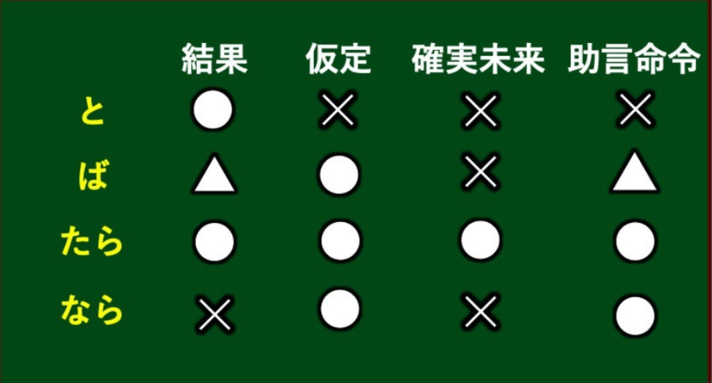

## 35课

### 语法

#### **（1）～たら**

**接続：**动词、形容词、形容动词的过去形 + たら　

​			名词 ＋だったら

**意味：**表示假定，有了前项的条件、因素、契机等发了后项，强调先后顺序。可以在假设前项完成基础上，再假设后项内容(后项可以为确定会实际生或不确定实际是否会发生）。对于后项无任何限制，可以接命令、请求、劝诱等内容。

**注意：**二类形容词和名词的过去否定形式“ではなかった”后续“たら”，要去掉其中的“は”,		变成“でなかった”

**区分：**「と」「ば」「たら」「なら」

①結果：と、たら、（ば）

这个用法表达的是“**后面是前面的事情发生之后的结果**”。

这个不包括“假定”的意思，就是说**前面部分是一定会发生的**。

这个“结果”的用法，有下面这几种用法。

- 自然现象

  北海道では、冬になると（なったら）雪が降ります

- 习惯

  家に帰ったら（帰ると）まず手を洗います

- 发生意外的事情

  家に帰ると（帰ったら）、猫がいなくなっていた

上面三个都不是“假定“，而是真的会发生的事情吧。

在这个情况下，我们不能用“なら”，“ば”这个词“自然现象”这个用法的时候一般可以用，其他用法却不能用。因此最好避免使用。

 北海道では、冬になれば雪が降ります。（√）

家に帰れば、猫がいなくなっていた。（×） 

②假定：ば、たら、なら

这个用法表达的是“**前面部分还不知道会不会发生**”。

在这个情况下，我们不能用“と”。

其他三个词意思几乎一样，但是**前面的部分是100%不会发生，或者发生的可能性很少的情况的话，最好用“たら”**。

相反，标语等含有一般而言的意思的话，最好用“なら”。

“ば”在这两个词的中间，个人感觉跟“たら”语感更近。

③确定会发生：たら

这个用法表达的是“**前面是未来100%会发生的事情**”，只能用"たら"

◯ 明日雨だったら、家でゆっくりします。

◯ 明日雨なら、家でゆっくりします。

如果明天下雨，我就会在家里休息。（假定）

◯ 東京駅に着いたら連絡してください。

× 東京駅に着くなら連絡してください。

到了东京站就给我联系吧。（已经约好在东京站见面，100%会发生，所以只能用たら）

④助言命令：たら、なら、（ば）

意思：基于前面的事情，后面给对方建议或者命令（所以关键是说话人已经知道前面的事情，不然无法给对方建议或命令吧）

总结：

**建议：如果你不太清楚用哪个好的时候，就使用たら**

> 这本书如果看完了，请还给我（この本を読み終わったら、返してね）
>
> 如果吃了这个药，就会退烧（この薬を飲んだら、熱が下がります）
>
> 如果明天天气好的话，一起去玩吗？（明日いい天気だったら、遊びに行きませんか）
>
> 如果是平板的话，就可以下载那个游戏（タブレットだったら、そのゲームをダウンロードできます）
>
> 如果中意的手机便宜的话，就想要买它。（気に入る携帯が安かったら、買いたいです。）
>
> 如果工地的声音太吵的话，请把窗关上（工事の音がうるさかったら、窓を閉めてください）
>
> 如果明天不下雨，就去郊游（明日雨でなかったら／雨が降らなかったら、ハイキングに行きます）
>
> 如果聚会不开心的话，也可以先回家（パーティーが楽しくなかったら、先に家に帰ってもいいです。）
>

#### **（2）～ても**

**接続：**V（て形） + も
			イA + くても
			なA + でも
			N + でも

**意味：**即使……

> 即使被父母反对，我们也打算结婚（親に反対されても、僕たちは結婚するつもりです。）
>
> 即使中彩票，我也不打算买高价物品（宝くじが当たっても、高価な物を買うつもりはありません。）
>
> 那家餐馆的菜评价不好，即使便宜也绝对不去（あのレストランの料理は評判が悪いし、安くても絶対に行かない）
>
> 即使成绩不好，我也喜欢学习日语，所以毕业后也想继续学习（成績が悪くても、日本語の勉強は好きなので、卒業してからも続けたい。）
>

#### **（3）～でも**

**接続：**N/疑问词+でも

**意味：**

- 表类推：举出极端的例子来形容程度之极，称为“類推",多译为“连...也...”
- 表列举：列举某个种类，多用于询问对方，邀约的内容则是任意举个例子，代表还有选择的空间，口气上比较亲和，委婉。多译为“之类的/什么的
- 表全面：疑问词(如どこ、だれ、なん、いつ...)+でも則表示全面性的无线范围，后项只能接「肯定句」（不能接否定形或字眼）、多译为「无论~都~」

> 因为没有钱，所以星期天也要工作。（お金がないので、日曜日でも働きます。）
>
> 即使是星期六，我也是7点起床（私は土曜日でも、７時に起きます。）
>
> 就连祖母也使用智能手机（おばちゃんでもスマホを使っています）
>
> 这个问题很难，就连老师也不明白（この問題が難しい、先生でも分からないです）
>
> 要不要喝茶什么的？（ お茶でも飲みませんか。）
> 要不要去看電影什么的？（ 映画でも見に行こうか。）
>
> 桃太郎是誰都知道的故事。（桃太郎は誰でも知っている物語です。）
> 如果有什麼不懂的地方，歡迎隨時問我。（わからないことがあったら，いつでも聞いてください。 ）

#### **（4）「～だけ」と「～しか」**

**接続：**

だけ
		名词 + だけ
		 动词连体形+だけ
		 形容词（い）+だけ
		  形容词（な）+だけ

しか
		名词 + しか
		动词辞书形+しか

**意味：**只...

**注意：**

- 「しか」后用否定，「だけ」后可用肯定也可用否定。
  （まだ）半分だけある。（だから大丈夫）/还剩一半（所以没关系）。
  （もう）半分しかない。（だからダメ）/只剩下一半了（所以不行）。

- 「しか」比「だけ」更加具有排他性，特别用于强调情况的单一和特殊的限定，语气上更为强烈。

- 某些情况下，两者同时使用，更加突出其单一性。
  如：あの人は自分のことだけしか考えないよ。/那人只关心自己的事情（其他什么都不管）。

- 「しか」有一种遗憾的意味。
  如：５本しか借りません。/表示我原本想借５本以上的，但仅仅只能借５本，有一种遗憾的意味。而「だけ」无此意味。

> 只是有些累了而已。（少し疲れただけです。）
>
> 只有他去过日本（彼だけ日本へ行ったことがあるんです）
>
> 只有田中一个人能做这个工作（この仕事ができるのは田中だけだ。/
> この仕事ができるのは田中しかいない）
>
> 因为那里没有地铁，只能坐出租车去 （あそこは地下鉄がないから、タクシーで行くしかない ）

### 表达及词语

#### （1）何かあった

> 车站附近发生了什么事？聚集了很多人哪（駅前で何があったんですか、人が集まっていますよ）

#### （2）あと～

> （会议再过10min钟就开始啦）会議はあと10分だけ始まりますよ

#### （3）どの家でも

> 近来，任何一家公司的办公室都有电脑（最近、どの会社でも、事務所にパソコンがあります）
>
> 这个电子游戏很简单，谁都会玩（このゲームは簡単ですから、だれでもできます）

#### （4）本の通りに

> 昨天如天气预报所说的那样下大雨了（昨日は天気予報の通りに、大雨が降りました）

#### （5）なかなか

- なかなか+可能动词，状态+ ない：表示不容易... ；难以...
- 颇，很，非常，相当

> 我照着书也老是做不好（ほんの通りに作っても、なかなかうまくできないんです）
>
> 因为喝了咖啡，晚上难以入睡（コーヒーを読んだので、なかなか眠れないでした）

#### （6）だんだん

- 「だんだん」  逐步上升；一步一步，慢慢地，渐渐地
- 「どんどん」　快速上升；变化比较快

> 天气越来越热（天気はだんだん暑くなってきました）

#### （7）３０個は大丈夫ですよ

### 补充

遗留问题：
（1）「だけ」と「しか」接続
だけ
名词 + だけ
动词连体形+だけ
形容词（い）+だけ
形容词（な）+だけ

しか
名词 + しか
动词辞书形+しか

（2）「鳴る 」と「鳴く 」
鳴く是自动词，主要指虫鸣，鸟，虫，兽的叫声；
鳴る也是自动词，指物体发出声音，或者名声大振；

（3）「評判」と「評価」
「評判」是指比较主观的对事物的评价，评价好，评价坏。也常说「評判がいいだ。」
「評価」这个词语感上有客观性，一般会说「評価が高い」

### 
