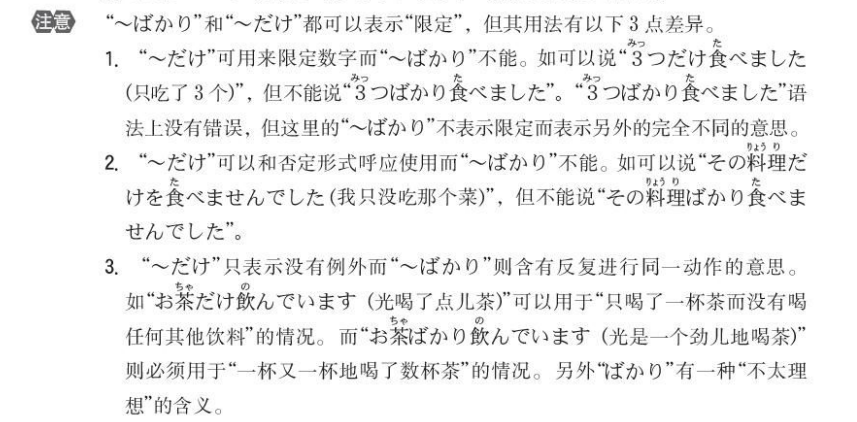

## 36课

### 语法

（1）小句1て、小句2／句1で、小句2

**接続：**V（て形）
			イA + くて
			なA + で
			N + で

**意味：**原因，理由

**注意：**后面的事情不能来意志表现。可以使用的只有表示感情的词语或者表示状态的词语

> 听到母亲精神饱满的声音，我就放心了（母の元気な声を聞いて、安心しました）
>
> 宠物死了，很悲伤（ペットが死んで、悲しかったです）
>
> 没能通过N3，很失望（N3に合格できなくて、がっかりしました）
>
> 不能说好日语，很丢人（日本語を上手にできなくて、恥ずかしかったです）
>
> 私の犬が交通事故で、死んでしまいました
>
> 中国が優勝したニューズを聞いて、みんな喜びました。

（2）名词＋に（用途，基准）

>这本书对大人来说很容易，可是对小孩来说很难（この本は大人にやさしいです、しかし、子供に難しいです）
>
>磁带对日语学习很有用（テープは日本語の勉強に役立ちます）

- 目的地・方向

  场所に＋动词		馬さんは家に帰りました

- 时间

  時間に＋动词		昼間にスーパーで買い物します

- 存在点

  场所に＋います／あります／住みます／生まれました	　冷蔵庫の中にビールがあります	

- 目标（人）

  人・物に＋动词		お母さんに花をあげます

- 目标的（位置）

  场所に　＋动词			ごみをゴミ箱に入れます

- 使役形对象

  對像に受词を＋动词使役形	母は弟に日本語を勉強させません

- 表示对于

  名词＋　に・には			パソコンは仕事に役立つ

- 物件[功能或用途]

  用途に　＋使います・利用します 等动词		このお金は車を借りるのに使います

- 转换,改变

  Xに　 +转换动词　　バスから電車に乗り換える

- 次数

  時間數に　數量  ＋動詞　　月に一回バスケットボールをします

- 移动的目的

  场所へ「動詞第2類變化」＋に　行きます・来ます		スーパーへ飲み物を買いに行きます
  场所へ「動作性名詞」 　 ＋に　行きます・来ます		日本へ留学に行きます

- 成败胜负

  「胜负的目的or目标」**に**勝つ・負ける			
  「合格的目的or目标」**に** 合格する・不合格する			試験に合格した
  「成败的目的or目标」**に**成功する・失敗する				

- 并列，累加

  名詞に　名詞に　名詞に　　昨日、靴にカバンに財布にベルトを買いました

（3）～のに

- 动词辞书形 + のに：表目的時，後句限使用表不可欠缺之條件，例如「必要、不可欠、使う、かかる、役に立つ...」等。

  > 互相了解是需要時間的。（お互いを理解するのに、時間が必要です。）
  >
  > 這把刀是用來切水果的（このナイフは果物を切るのに使う）
  >
  > 这张照片申请护照时用（この写真はパスポートを申請するのに使います）
  >
  > 为了去京都，经常使用新干线。（京都にいくのに、よく新幹線を利用します）

- 动词/形容词のに  名词+なのに：明明~卻~；雖然~然而~

  雨が降っているのに、太郎は出掛けていった。（明明下著雨，太郎還是出門了。）

  静かなのにうるさく感じる（明明就很安靜，卻感覺很煩躁。）

- 句尾+のに：遗憾，不满

  もう少し早く家を出ていたならば、あの電車に間に合ったのに。（要是再早點出門的話，就能趕上那班電車了。）

  メールしてねって言ったのに。（明明就跟你說要email給我的。）

（4）～ばかり

- N＋ばかり：都是

- た形＋ばかり：刚刚

  「～たところ」と「～たばかり」

  - ～たところ：表示客观时间
  - ～たばかり：表示主观的时间认定

  例如：会議が終わったばかりなので、今休んでいる。（表示客观时间，可能会议真的是五分钟才结束）

  ​			会議が終わったところなので、今休んでいる。（表主观认定时间，有可能会议早就结束了，但是他认为才刚结束）

- て形＋ばかりいる／Nばかり～ている：一直，总是（负面）（表示总是发生同样的事情或总是进行同样的动作）

> 林先生在卡拉OK尽唱一些老歌（林さんはカラオケで古い歌ばかり歌います）
>
> 儿子总是在读漫画（息子はマンガばかり読んでいます/ 息子はマンガを読んでばかりいます）
>
> 他能说日语，但总是使用英语（彼は日本語が話せますが、いつも英語ばかり使っています）
>
> 因为上司是个非常有趣的人，所以我总是在笑（上司がおもしろい人なので、私は笑ってばかりいます）
>
> *刚来日本的时候，日语一点儿也不懂（日本に来たばかりの顷は、日本语がぜんぜん分かりませんでした）
>
> *因为上周刚出院，所以还不能运动（先週退院したばかりだから、まだスボーツはできません）

（5）小句（动词简体形）のが＋見えます／聞こえます

> 可以看到机场入口处站着警官。（空港の入り口に警官が立っているのが見えます。）
>
> 能听到在隔壁房间孩子们吵嚷的声音吗？（隣の部屋で子供たちが騒いでいるのが聞こえますか。）
>
> 听到哪里在弹吉他（どこかピアノを弾いているのが聞こえます）
>
> 看到森现在在操场发棒球（グランドで森さんが野球をしているのが見えます）

### 表达及词语

（1）凧（たこ）

（2）とにかく

> 特别是开始的时候语言不通，非常困难（とにかく最初は言葉が通じなくて、とても困ります）
>
> 总之不早点出发的话，就赶不上公交啦（とにかく早く出発しないと、バスに間に合わないよ）

（3）ぺらぺら

（4）量り売り（はかりうり）
