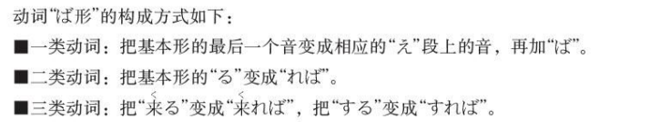
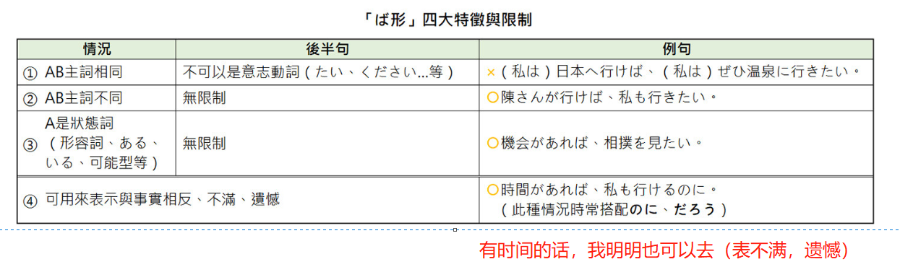
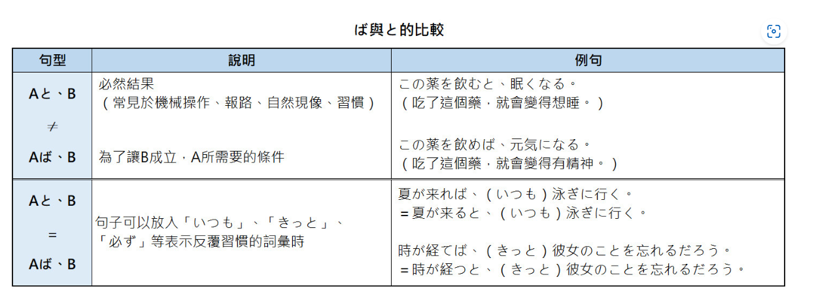

## 36课

### 语法

#### （1）ば形

**接続：**用言第五变化（假定形）+ば		

**説明：**

- 表假定條件。當前句為假設的條件時，則造成後句的結果，「ならば」也可省略為「なら」，中譯多為「如果～就～」。

  >安ければ買います
  >
  >あの人は東大の卒業生なら（ば）、採用します

- 表恆常的必然條件，如：自然現象、數學定理、合乎常理、個人習慣等。

  >冬になれば寒くなる
  >
  >値段が高ければ、買う人が少なくなる

**注意：**

**拓展：**

#### （2）なら

**接続：**动词原形·否定形·名词＋なら

**説明：**表假定條件。當前句為假設的條件時，則造成後句的結果。主要用于，假设前面的动作尚未进行，而给予后面的建议和意见

> 富士山に登るなら、富士宮ルートが進めです
>
> ご飯を食べるなら、手を洗ってください

**拓展：**「なら」、「たら」

「なら」：表示前面的动作尚未进行，多用于建议。感觉较正式。

「たら」：表示前面的动作已经完成。感觉较口语。（使用频率较高）

#### （3）でも

**接続：**N/疑问词+でも

**説明：**

- 表类推：举出极端的例子来形容程度之极，称为“類推",多译为“连...也...”
- 表列举：列举某个种类，多用于询问对方，邀约的内容则是任意举个例子，代表还有选择的空间，口气上比较亲和，委婉。多译为“之类的/什么的
- 表全面：疑问词(如どこ、だれ、なん、いつ...)+でも則表示全面性的无线范围，后项只能接「肯定句」（不能接否定形或字眼）、多译为「无论~都~」

> 就连祖母也使用智能手机（おばちゃんでもスマホを使っています）
>
> 这个问题很难，就连老师也不明白（この問題が難しい、先生でも分からないです）
>
> 要不要喝茶什么的？（ お茶でも飲みませんか。）
> 要不要去看電影什么的？（ 映画でも見に行こうか。）
>
> 桃太郎是誰都知道的故事。（桃太郎は誰でも知っている物語です。）
> 如果有什麼不懂的地方，歡迎隨時問我。（わからないことがあったら，いつでも聞いてください。 ）

#### （4）とか

**接続：**名詞・動詞普通形＋とか

**説明：**表示列舉相似的項目，中譯多為「或、之類的、…啦…啦等等」

> タクシーとかバスとか乗ると気分が悪くなります
>
> 休みの日には、ゲームするとかテレビを見るとかして時間をつぶしています

**拓展**：

- ～や～など

  「とか」基本上就相當於「～や～など」，只是「とか」比較口語。另外「や」只能接在名詞，「とか」則無限制。一般來說名詞列舉會比較常使用「～や～など」。

- ～たり～たり

  在動作列舉方面，「とか」也相當於「たり」，只是使用頻率上比較常看到「～たり～たり」。另外，「～たり～たり」只能接在動詞，「とか」則無限制。

- ～やら～やら

  「やら」也同樣是表示列舉，不過「やら」多用於「大量、東西多」的感覺，或是心情感到複雜、不好的感受，令人困擾、傷腦筋等。

### 表达及词语

#### （1）買っちゃった

～ちゃった：～てしまった的口语形式，语义基本相同，但是令人不愉快的语气比～てしまった弱

#### （2）2時間ちょっとですね

两小时多一点，除了可以接在时间词后面之外，还可以接在各种数量词。

例如：2万円ちょっと／2杯ちょっと

#### （3）さすが

表示收到高度评价的人或物名副其实，确实如别人所评价的那样

さすが「世界遺産」です

