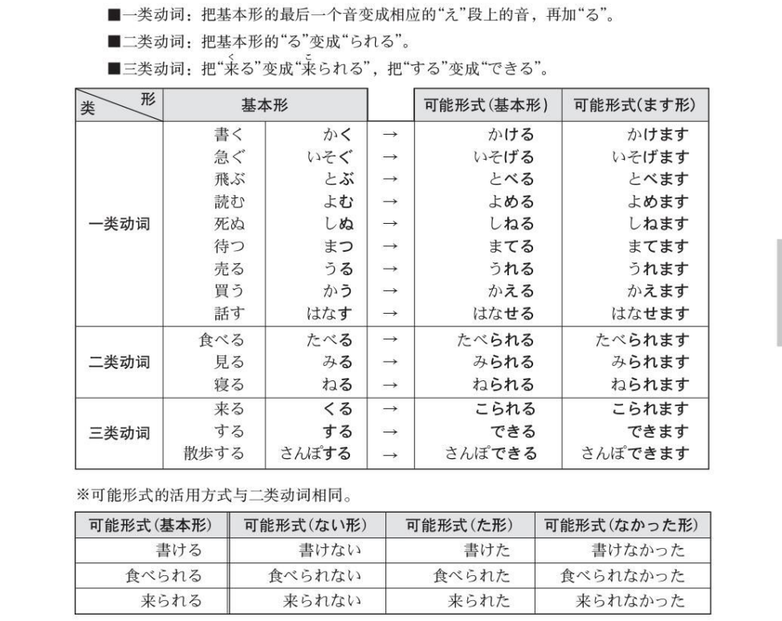
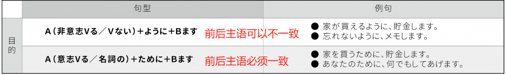
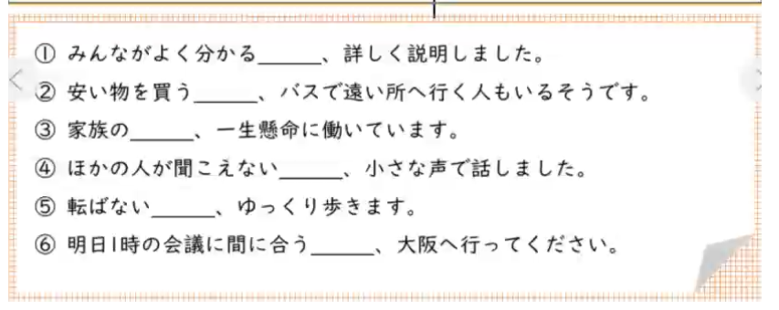

## 38課

### 语法

#### （1）可能形

**注意：**一般句型中，动词前方会使用助词「を」，但是如果后方是可能形的话，那么也可以使用助词「が」。一般情况下，使用「が」的频率较高

私は納豆を食べます　　＝＞　　　私は納豆が食べられます

私はパソコンを使います　　＝＞　　私はパソコンが使えます

私は仕事をします　　＝＞　　私は仕事ができます

#### （2）~ように

- 目的

  接続：Ａ（非意志Vる／Ｖない）＋ように＋Ｂます

  説明：为了A而B

  例文：家を買えるように、貯金します

  ​				日本語を話せるように、一生懸命勉強します。

  ※ 什麼是「非意志动词」呢？简单来说，只要动词无法以「たい、ましょう、ください、てもいいです、なければなりません、禁止形」等方式表现时就是「非意志动词」。

  注意：「～ように」と「～ために」

  

  

  

- 比喻用法

  接続：名＋の＋ように

  説明：像....一样；跟....一样

  例文：王さんの靴下は腐った魚のように臭い

  ​				彼の運転は亀のように遅い

- 能力变化

  接続：能力Ｖ原＋ようになりました

  説明：本来不会....，但是现在变得会...了

  例文：英語が話せるようになりました		→（本來不会說英文）現在变得会说英文了

  ​			 料理ができるようになりました。	→（本來不会做菜）現在变得会做菜了。

  注意：「一般Ｖ原」＋ようになりました这时候意思是「情况，习惯的变化」，也就是说「本来就会...只是不做，但是现在又开始...了」

  　野菜を食べるようになりました。	— 本來就变吃蔬菜，只是不吃，但現在又開始吃了。

- 委婉的要求

  接続：Ｖ原／Ｖない+ようにしてください

  説明：教客气不直接，常用于叮嘱对方

  例文：早く寝るようにしてください。		→请你早一点睡喔！

  ​				一日に薬を三回飲むようにしてください。	→一天请服三次药喔！

  注意：如果句型不是てください，而是「Ｖ原／Ｖない+ようにします」或「Ｖ原／Ｖない+ようにしています」時，意思是「人为的努力与坚持」，用来表示「尽可能…」、「坚持…」

  ​			康のために、お酒を飲まないようにしています。 → 為了健康，尽可能地不要喝酒。

- 依赖、指示、请求

  接続：Ｖ原／Ｖない+ように

  説明：教客气不直接，常用于叮嘱对方

  例文：友人にお金を貸すように頼まれました。 → 被朋友拜託要借錢給他

  ​				お医者さんに甘い物を食べないように(と)注意されます。→ 被醫生警告請不要吃甜食。

  注意：

  - 此种用法后面常会接「言います」、「頼みます」、「お願いします」、「命令します」、「注意します」等指示性动词
  - 在日本的神社常會看到「絵馬（えま①）」上面写着「試験に合格しますように」、「彼女ができますように」之类的愿望。这是一种对神明的请求，由于对方是神明，因此使用「**Vます+ように**」表达尊敬，若是你跟別人讲说「我向神明许某种愿望」時，句子就会变成「試験に合格しますように頼みました」、「彼女ができますようにお願いしました」

### 表达及词语

#### （1）入り組んでいます

表示事物之间互相交织，极其复杂的样子，常用于形容迷宫一样的胡同道路，或者极其复杂的谈话内容

> この道は入り組んでいますが、通り抜けられますよ
>
> 話が入り組んでいて、半分ぐらいしか分かりません

#### （2）なんだが

表示一种理由不明确的感觉或者判断，多用于表述说话者的心理活动

> この道、暗くて、なんだか怖いですね

#### （3）見えます・見られす

見る：見られる（可以看见）		見える（看得见）

聞く：聞ける（可以听见）				聞こえる（听得见）

二者区别在于：

見える：中文译为"看得见"，表示某物体或景物不受任何阻隔，自然而然地进入视野当中

見られる：中文译为"可以看见"，表示经由自己的个人判断，选择去观看特定的东西

>この窓から富士山が見える
>
>あのホテルの屋上に行けば、富士山が見られる

聞こえる：中文译为"听得见"，表示某物体或劲舞不受阻隔，自然而然地进入耳朵在

聞ける：中文译为"可以听见"，表示经由自己的个人判断，去听特定的东西

>朝鶏の鳴き声が聞こえる
>
>テレビをつけると、アナウンサーの声が聞ける

#### （4）ら抜き言葉