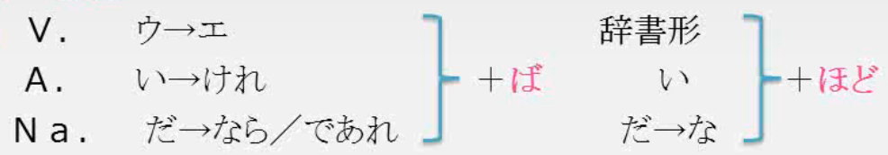

## 45课

### 単語

（１）どんどん、だんだん、ますます

- 「だんだん」  逐步上升；一步一步，慢慢地，渐渐地
- 「どんどん」　快速上升；变化比较快
- 「ますます」在原有基础上更上一个新台阶，属于递进表达。用于对眼前客观事物的感受

（２）冷凍食品、インスタント

（３）痛車（いたしゃ）　

俗に、アニメやゲームのキャラクターなどを描いたり、印刷シートで装飾したりした自動車

### 文法

#### （1）～てくる／ていく

- 空间上移动的方向：「てくる」表示由远及近的移动，「ていく」表示由近及远的移动

  サメが泳いでいきました

  虫が顔に飛んできました

- 时间的经过：以当时说话的时间点作为基准，从过去持续到现在使用「てくる」（一般是过去式てきた），从现在持续到将来使用「ていく」

  死ぬまで勉強し続けていくべきだ

  20年間、ずっと一人ぼっちで生きてきた

- 状态的变化：由其他状态变化为现如今的状态使用「てくる」，由现如今的状态变化为其他的状态使用「ていく」

  - 逐渐的，渐渐的变化

    少し太ってきたから、ダイエットでも始めようか

    日本語を学ぶ人はこれからもどんどん増えていくでしょう

  - 现象的发生：从无到有(**只限てくる**)

    様々なアイデアが浮かんできた

  - 声音或气味离说话人越来越近或越来越远

    隣の家から、ピアノの音が聞こえてきた

    歩いていると、焼肉のにおいがしてきた

- 其他使用方式(准确的说是て形的使用方式，て形与くる，いく具备独立含义)

  - 动作相继发生

    ①ちょっと、ご飯でも食べていきます。【吃饭完(之后)再去。】

    ②ちょっとトイレ行ってくるね。【稍微去个厕所再回来。】(也可看做一个循环性的动作--从这里离开上厕所，再返回到这里)

  - 表示动作主体的状况--伴随状态

    汚い帽子をかぶってきました【带着个脏帽子就回来了】

    傘を持っていこう。【带着伞去吧】

扩展：

～始める、～出す、～てくる（现象的发生：从无到有）

- ～始める  可计划性
- ～出す        意外性，突然性
- ～てくる    不可操控性

#### （2）~（も）~し、～（も）～

接続：普通形/敬体＋し

意味：列举，可以列举断定的根据，原因

例文：この花は匂いもいいし、色もきれいです（列举）

　　　彼はタバコも吸わないし、お酒も飲まないし、いい青年です（列举）

　　　京都は近いし、きれいだから、よく行きます（原因）

#### （3）～ば～ほど

接続：

意味：”越.....越”

例文：練習すればするほど、上手になるでしょう

​				このカレー、食べれば食べるほど、辛い

​				高ければ高いほど、いいものだと思う人がいますね　

​				部屋がきれいならきれいなほど、気持ちがいい

（1）交通の便がいい

- 交通の便がいい    交通非常方便
- 交通の便が悪い    交通非常不便

この辺は交通の便が悪いので、部屋代はあまり高くないです

（2）ライトアップされています

ライトアップ　　外来词，景观照明，指夜间给建筑物或纪念碑等打上灯光

ライトアップさていますね。見れば見るほどきれいだよね

（３）以前

（４）なんか

（５）～に似ています

（６）アクセスが良くなりました

（７）軽く食べていきましょう

